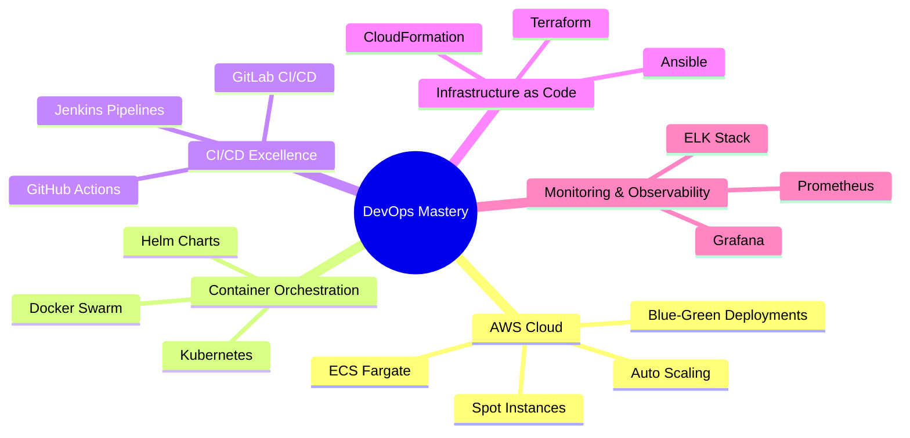

# 🚀 Hey there! I'm Vivek Kumar (Vikky) 

<div align="center">
  
</div>

<div align="center">
  
</div>

---

## 🌟 About Me

```yaml
name: "Vivek Kumar"
role: "DevOps Engineer & Cloud Architect"
location: "India 🇮🇳"
current_focus: 
  - "AWS ECS Fargate & Spot Instances"
  - "Blue-Green Deployments"
  - "Kubernetes Orchestration"
  - "CI/CD Pipeline Optimization"
passion: ["Cloud Infrastructure", "Automation", "Ethical Hacking", "Chess ♟️"]
philosophy: "Automate everything, fail fast, learn faster! 🎯"
```

<div align="center">
  
</div>

---

## 🛠️ **Technology Arsenal**

<div align="center">

### ☁️ **Cloud & DevOps**


### 🔄 **CI/CD & Automation**


### 💻 **Programming & Scripting**


### 🗄️ **Databases & Monitoring**


### 🐧 **Operating Systems & Tools**


### 🔒 **Security & Ethical Hacking**


</div>

---

## 🎯 **Current Focus Areas**

<div align="center">
  
</div>



---

## 🚀 **Featured Projects**

<div align="center">

### 🛒 **Fashion Washion E-Commerce Platform**
*Modern e-commerce solution with robust AWS infrastructure*

[](https://github.com/vikky1701/fashion-washion)

**Tech Stack:** AWS ECS Fargate, Docker, Jenkins CI/CD, Terraform, React, Node.js
- **Blue-Green Deployment** with zero downtime
- **Auto-scaling** ECS services with Fargate Spot instances
- **Multi-stage CI/CD pipeline** with automated testing
- **Infrastructure as Code** using Terraform

---

### 📈 **ML-Powered Stock Prediction Platform**
*Python-based machine learning with automated DevOps workflows*

[](https://github.com/vikky1701/stock-prediction)

**Tech Stack:** Python, Docker, Kubernetes, Jenkins, AWS ECS, TensorFlow
- **Containerized ML pipeline** with Docker
- **Kubernetes orchestration** for scalability
- **Automated model training** and deployment
- **Real-time data processing** with streaming analytics

---

### ☁️ **Cloud Infrastructure Automation Suite**
*Complete infrastructure automation with Terraform and Ansible*

[](https://github.com/vikky1701/cloud-automation)

**Tech Stack:** Terraform, Ansible, AWS, Kubernetes, Shell Scripting
- **Multi-cloud infrastructure** provisioning
- **Automated configuration management**
- **Kubernetes cluster deployment**
- **Cost optimization** with Spot instances

---

### 🔒 **Cybersecurity Testing Lab**
*Ethical hacking and penetration testing environment*

[](https://github.com/vikky1701/security-lab)

**Tech Stack:** Kali Linux, Metasploit, Ettercap, Docker, Ubuntu
- **Virtualized testing environment**
- **Automated vulnerability scanning**
- **Network penetration testing**
- **Security assessment tools**

</div>

---

## 📊 **GitHub Analytics Dashboard**

<div align="center">
  
</div>

<div align="center">
  
  
</div>

<div align="center">
  
</div>

<div align="center">
  
</div>

---

## 🏆 **Achievements & Certifications**

<div align="center">
  
</div>

<div align="center">


### 🎯 **GitHub Achievements**
[](https://github.com/ryo-ma/github-profile-trophy)

</div>

---

## 📈 **DevOps Metrics & KPIs**

<div align="center">

| Metric | Achievement | Target |
|--------|-------------|---------|
| 🚀 **Deployment Frequency** | Daily | Multiple/day |
| ⚡ **Lead Time** | < 2 hours | < 1 hour |
| 🎯 **Change Failure Rate** | < 5% | < 2% |
| 🔄 **Recovery Time** | < 30 min | < 15 min |
| ☁️ **Infrastructure Uptime** | 99.9% | 99.99% |
| 💰 **Cost Optimization** | 40% saved | 50% target |

</div>

---

## 🌐 **Connect & Collaborate**

<div align="center">
  
</div>

<div align="center">

[](mailto:vivek1217.work@gmail.com)
[](tel:+917081128914)
[](https://instagram.com/vikky._17)
[](https://github.com/vikky1701)
[](https://linkedin.com/in/vivek-kumar-devops)

</div>

---

## 💭 **Daily Motivation**

<div align="center">
  
</div>

---

## 🎮 **When I'm Not Coding**

<div align="center">

```ascii
    ♟️ Chess Strategy    🧠 Philosophy    🔍 Psychology    🎯 Problem Solving
         │                    │               │                  │
         └────────────────────┼───────────────┼──────────────────┘
                              │               │
                         🚀 Innovation  💡 Creativity
```

</div>

---

<div align="center">
  
</div>

<div align="center">
  
### 🌟 **"Automate Today, Innovate Tomorrow!"** 🌟


</div>

---

<div align="center">
  
</div>
