<div align="center">
  
</div>

<div align="center">
  
</div>

---

<div align="center">

## ⚡ **PROFILE** ⚡

</div>

<div align="center">
  
</div>

<div align="center">
  <table>
    <tr>
      <td align="center" style="background: url('https://user-images.githubusercontent.com/74038190/225813708-98b745f2-7d22-48cf-9150-083f1b00d6c9.gif'); background-size: cover; border-radius: 15px; padding: 30px;">
        


```yaml
name: "Vivek Yadav (Vikky)"
role: "DevOps Engineer & Cloud Architect"
location: "Greater noida, India 🇮🇳"
status: "Building the Future • Online"

specialization:
  cloud: "AWS ECS Fargate • Spot Orchestration"
  containers: "Docker • Kubernetes • Helm"
  automation: "CI/CD • Jenkins • Terraform"
  security: "Ethical Hacking • Pen Testing"

philosophy: "Automate Everything • Scale Infinitely"
mission: "Infrastructure as Code Architect"
```


    
  </table>
</div>

---

<div align="center">

## 🏗️ **ARCHITECTURE MASTERY** 🏗️

</div>

<div align="center">


</div>

---

<div align="center">

## 🚀 **SKILL MASTERY MATRIX** 🚀

</div>

<div align="center">

### ☁️ **Cloud Platforms**


```
AWS        ████████████████████ 95%
Azure      ██████████████░░░░░░ 70%
GCP        ████████████░░░░░░░░ 60%
```

### 🐳 **Container Orchestration**


```
Docker     ████████████████████ 95%
Kubernetes ███████████████████░ 90%
Swarm      ████████████████░░░░ 80%
```

### 🏗️ **Infrastructure as Code**


```
Terraform     ███████████████████░ 90%
Ansible       █████████████████░░░ 85%
CloudFormation████████████████░░░░ 80%
```

### 💻 **Programming & Scripting**


```
Shell Scripting ████████████████████ 95%
Python          █████████████████░░░ 85%
Java            ████████████████░░░░ 80%
JavaScript      ███████████████░░░░░ 75%
```

### 🔄 **CI/CD & Automation**


```
Jenkins        ███████████████████░ 90%
GitHub Actions █████████████████░░░ 85%
GitLab CI      ████████████████░░░░ 80%
```

### 📊 **Monitoring & Observability**


```
Prometheus █████████████████░░░ 85%
Grafana    ████████████████░░░░ 80%
ELK Stack  ███████████████░░░░░ 75%
```

</div>

---

<div align="center">

## 🎯 **DEVOPS PROJECTS** 🎯

</div>

<div align="center">

### 🔄 **CI/CD Pipeline Automation**
*Automated Build, Test & Deployment Pipeline*

```mermaid
graph LR
    A[📝 Code Commit] --> B[🔄 Jenkins Pipeline]
    B --> C[🧪 Automated Testing]
    C --> D[🐳 Docker Build]
    D --> E[📦 Container Registry]
    E --> F[🚀 ECS Deployment]
    F --> G[📊 Monitoring]
    
    style B fill:#00f5ff,stroke:#333,stroke-width:2px
    style F fill:#00ff00,stroke:#333,stroke-width:2px
```

[](https://github.com/vikky1701/cicd-pipeline)



**🔧 Technologies:** Jenkins, Docker, AWS ECS, Git, Shell Scripting, Terraform
**⚡ Features:** Automated testing, Blue-green deployment, Rollback capability, Slack notifications

---

### 🛠️ **Strapi CMS Automation**
*Automated Strapi Deployment & Management*

```mermaid
graph TD
    A[📱 Strapi CMS] --> B[🐳 Docker Container]
    B --> C[☸️ Kubernetes Pod]
    C --> D[🗄️ PostgreSQL DB]
    C --> E[📦 File Storage]
    F[🔄 Automation Scripts] --> G[📊 Health Checks]
    G --> H[🚨 Auto Scaling]
    
    style F fill:#ff6b6b,stroke:#333,stroke-width:2px
    style C fill:#00f5ff,stroke:#333,stroke-width:2px
```

[](https://github.com/vikky1701/strapi-automation)



**🔧 Technologies:** Strapi, Docker, Kubernetes, PostgreSQL, Ansible, Bash Scripts
**⚡ Features:** Auto-scaling, Database backups, SSL automation, Performance monitoring

---

### ☁️ **Infrastructure as Code Suite**
*Terraform & Ansible Infrastructure Automation*

[](https://github.com/vikky1701/infrastructure-automation)


**🔧 Technologies:** Terraform, Ansible, AWS, Shell Scripting, Jenkins
**⚡ Features:** Multi-environment deployment, Cost optimization, Automated backups, Security hardening

</div>

---

<div align="center">

## 📊 **SYSTEM METRICS** 📊

</div>

<div align="center">
  
</div>

<div align="center">
  
  
</div>

<div align="center">
  
</div>

<div align="center">
  
</div>

---

<div align="center">

## 🏆 **PERFORMANCE METRICS** 🏆

</div>

<div align="center">

| **METRIC** | **CURRENT** | **TARGET** | **STATUS** |
|------------|-------------|------------|-------------|
| 🚀 **Deploy Frequency** | `DAILY` | `HOURLY` | ████████░░ 80% |
| ⚡ **Lead Time** | `< 1 HOUR` | `< 15 MIN` | ███████░░░ 70% |
| 🎯 **Success Rate** | `99.5%` | `99.9%` | █████████░ 90% |
| 🔄 **Recovery Time** | `< 10 MIN` | `< 5 MIN` | ████████░░ 80% |
| ☁️ **Uptime** | `99.95%` | `99.99%` | █████████░ 95% |
| 💰 **Cost Optimization** | `45% SAVED` | `60% TARGET` | ███████░░░ 75% |

</div>

---

<div align="center">

## 📡 **CONNECT** 📡

</div>

<div align="center">

[](mailto:vivek1217.work@gmail.com)
[](tel:+917081128914)

[](https://github.com/vikky1701)
[](https://instagram.com/vikky._17)

</div>

---

<div align="center">

## 🧠 **NEURAL INSPIRATION** 🧠

</div>

<div align="center">
  
</div>

---

<div align="center">

## 🎭 **OFF-GRID ACTIVITIES** 🎭

</div>

<div align="center">

```ascii
    ♟️ Chess Strategist    🧠 Philosophy    🔍 Psychology    🎯 Problem Solving
         │                      │              │                  │
         └──────────────────────┼──────────────┼──────────────────┘
                                │              │
                          🚀 Innovation   💡 Creative Destruction
```

</div>

---

<div align="center">
  
</div>

<div align="center">

**🌟 "CODE • DEPLOY • DOMINATE" 🌟**


</div>

---

<div align="center">
  
</div>
