<div align="center">
  
</div>

<div align="center">
  
</div>

---

<div align="center">

## ⚡ **THE MATRIX** ⚡

</div>

<div align="center">


```yaml
◢ ENTITY_PROFILE ◤
━━━━━━━━━━━━━━━━━━━━━━━━━━━━━━━━━━━━━━━━
designation: "Senior DevOps Architect"
alias: ["Vikky", "The Infrastructure Whisperer"]
coordinates: "India 🇮🇳"
status: "ONLINE • BUILDING THE FUTURE"

◢ CORE_CAPABILITIES ◤  
━━━━━━━━━━━━━━━━━━━━━━━━━━━━━━━━━━━━━━━━
cloud_mastery: "AWS ECS Fargate • Spot Orchestration"
container_sorcery: "Docker • K8s • Helm Wizardry"
pipeline_architecture: "Jenkins • GitHub Actions • GitLab"
infrastructure_magic: "Terraform • Ansible • IaC"
security_warfare: "Ethical Hacking • Pen Testing"

◢ NEURAL_NETWORK ◤
━━━━━━━━━━━━━━━━━━━━━━━━━━━━━━━━━━━━━━━━
philosophy: "Code • Deploy • Scale • Repeat ∞"
mission: "Transforming Infrastructure into Art"
```


</div>

---

<div align="center">

## 🏗️ **ARCHITECTURE MASTERY** 🏗️

</div>

<div align="center">


</div>

---

<div align="center">

## 🚀 **SKILL MASTERY MATRIX** 🚀

</div>

<div align="center">

### ☁️ **Cloud Platforms**


```
AWS        ████████████████████ 95%
Azure      ██████████████░░░░░░ 70%
GCP        ████████████░░░░░░░░ 60%
```

### 🐳 **Container Orchestration**


```
Docker     ████████████████████ 95%
Kubernetes ███████████████████░ 90%
Swarm      ████████████████░░░░ 80%
```

### 🏗️ **Infrastructure as Code**


```
Terraform     ███████████████████░ 90%
Ansible       █████████████████░░░ 85%
CloudFormation████████████████░░░░ 80%
```

### 💻 **Programming & Scripting**


```
Shell Scripting ████████████████████ 95%
Python          █████████████████░░░ 85%
Java            ████████████████░░░░ 80%
JavaScript      ███████████████░░░░░ 75%
```

### 🔄 **CI/CD & Automation**


```
Jenkins        ███████████████████░ 90%
GitHub Actions █████████████████░░░ 85%
GitLab CI      ████████████████░░░░ 80%
```

### 📊 **Monitoring & Observability**


```
Prometheus █████████████████░░░ 85%
Grafana    ████████████████░░░░ 80%
ELK Stack  ███████████████░░░░░ 75%
```

</div>

---

<div align="center">

## 🎯 **FEATURED PROJECTS** 🎯

</div>

<div align="center">

### 🛒 **Fashion Washion E-Commerce Platform**
*Production-Ready Scalable E-Commerce Solution*

```mermaid
graph LR
    A[👤 User] --> B[🌐 CloudFront CDN]
    B --> C[⚖️ Application Load Balancer]
    C --> D[🐳 ECS Fargate Cluster]
    D --> E[🔄 Blue/Green Deployment]
    E --> F[📊 Auto Scaling Group]
    F --> G[🗄️ RDS PostgreSQL]
    F --> H[📦 S3 Static Assets]
    D --> I[📈 CloudWatch Monitoring]
    I --> J[🚨 SNS Alerts]
    
    style A fill:#00f5ff,stroke:#333,stroke-width:2px
    style D fill:#ff6b6b,stroke:#333,stroke-width:2px
    style E fill:#00ff00,stroke:#333,stroke-width:2px
```

[](https://fashion-washion.example.com) 
[](https://github.com/vikky1701/fashion-washion)
[](https://github.com/vikky1701/fashion-washion/wiki)



**🔧 Tech Stack & Architecture:**
- **Frontend:** React.js, TypeScript, Tailwind CSS
- **Backend:** Node.js, Express.js, RESTful APIs
- **Database:** PostgreSQL with read replicas
- **Infrastructure:** AWS ECS Fargate, ALB, CloudFront
- **CI/CD:** Jenkins Pipeline with automated testing
- **Monitoring:** Prometheus, Grafana, CloudWatch

**⚡ Key Achievements:**
- `99.9%` uptime with zero-downtime deployments
- `40%` cost reduction using Fargate Spot instances
- `3x` faster load times with CDN optimization
- Automated blue-green deployments with rollback capability

---

### 📈 **AI-Powered Stock Prediction Engine**
*Machine Learning Pipeline with Real-Time Analytics*

```mermaid
graph TD
    A[📊 Data Sources] --> B[🔄 Data Pipeline]
    B --> C[🧠 ML Training Pipeline]
    C --> D[📦 Model Registry]
    D --> E[🚀 Model Serving API]
    E --> F[📱 Web Application]
    
    B --> G[📈 Real-time Streaming]
    G --> H[⚡ Kafka Streams]
    H --> I[🔮 Prediction Engine]
    I --> F
    
    C --> J[☸️ Kubernetes Jobs]
    J --> K[📊 MLflow Tracking]
    E --> L[🐳 Docker Containers]
    L --> M[🔄 Auto Scaling]
    
    style C fill:#ff6b6b,stroke:#333,stroke-width:2px
    style E fill:#00f5ff,stroke:#333,stroke-width:2px
    style I fill:#00ff00,stroke:#333,stroke-width:2px
```

[](https://stock-predictor.example.com) 
[](https://github.com/vikky1701/stock-prediction)
[](https://github.com/vikky1701/stock-prediction/blob/main/PERFORMANCE.md)



**🔧 Tech Stack & ML Pipeline:**
- **ML Framework:** TensorFlow, Scikit-learn, Pandas
- **Data Pipeline:** Apache Kafka, Apache Airflow
- **Container Orchestration:** Kubernetes, Helm Charts
- **Model Serving:** TensorFlow Serving, FastAPI
- **Infrastructure:** AWS EKS, EC2 Spot Instances
- **Monitoring:** Prometheus, Grafana, MLflow

**⚡ Key Achievements:**
- `87.2%` prediction accuracy on test dataset
- Real-time processing of `10K+` data points per second
- Automated model retraining with drift detection
- Scalable architecture handling `1M+` daily predictions

---

### ☁️ **Multi-Cloud Infrastructure Automation Suite**
*Enterprise-Grade Infrastructure as Code Platform*

```mermaid
graph TB
    A[🔧 Terraform Modules] --> B[☁️ Multi-Cloud Deployment]
    B --> C[🔴 AWS Infrastructure]
    B --> D[🔵 Azure Resources]
    B --> E[🟡 GCP Services]
    
    F[⚙️ Ansible Playbooks] --> G[🔧 Configuration Management]
    G --> H[🐧 Linux Servers]
    G --> I[☸️ Kubernetes Clusters]
    G --> J[🗄️ Database Setup]
    
    K[🔄 CI/CD Pipeline] --> L[✅ Validation & Testing]
    L --> M[🚀 Automated Deployment]
    M --> N[📊 Infrastructure Monitoring]
    
    O[💰 Cost Optimization] --> P[📈 Resource Scaling]
    P --> Q[⏰ Scheduled Scaling]
    P --> R[💡 Spot Instance Management]
    
    style B fill:#00f5ff,stroke:#333,stroke-width:2px
    style G fill:#ff6b6b,stroke:#333,stroke-width:2px
    style M fill:#00ff00,stroke:#333,stroke-width:2px
```

[](https://github.com/vikky1701/cloud-automation)
[](https://registry.terraform.io/modules/vikky1701)
[](https://github.com/vikky1701/cloud-automation/wiki)



**🔧 Tech Stack & Automation:**
- **IaC Tools:** Terraform, Ansible, Pulumi
- **Cloud Platforms:** AWS, Azure, GCP
- **Container Platform:** Kubernetes, Docker
- **CI/CD:** Jenkins, GitHub Actions, GitLab CI
- **Monitoring:** Prometheus, Grafana, ELK Stack
- **Secret Management:** HashiCorp Vault, AWS Secrets Manager

**⚡ Key Achievements:**
- `50+` reusable Terraform modules published
- `60%` reduction in infrastructure provisioning time
- Cross-cloud disaster recovery with `RTO < 15 minutes`
- Automated cost optimization saving `$10K+` monthly

---

### 🔒 **Cybersecurity Testing & Automation Lab**
*Advanced Penetration Testing & Security Automation*

```mermaid
graph LR
    A[🎯 Target Systems] --> B[🔍 Reconnaissance]
    B --> C[📊 Vulnerability Scanning]
    C --> D[⚡ Exploitation]
    D --> E[🏴‍☠️ Post-Exploitation]
    E --> F[📝 Reporting]
    
    G[🤖 Automation Scripts] --> H[🔄 Scheduled Scans]
    H --> I[📊 Dashboard Updates]
    I --> J[🚨 Alert System]
    
    K[🐳 Docker Environment] --> L[🔧 Tool Deployment]
    L --> M[🌐 Network Simulation]
    M --> N[📈 Performance Metrics]
    
    style D fill:#E74C3C,stroke:#333,stroke-width:2px
    style G fill:#00f5ff,stroke:#333,stroke-width:2px
    style J fill:#ff6b6b,stroke:#333,stroke-width:2px
```

[](https://github.com/vikky1701/security-lab)
[](https://github.com/vikky1701/security-lab/tree/main/reports)
[](https://github.com/vikky1701/security-lab/tree/main/tools)



**🔧 Security Arsenal & Tools:**
- **OS Platform:** Kali Linux, Parrot Security OS
- **Frameworks:** Metasploit, Cobalt Strike, Empire
- **Network Tools:** Nmap, Ettercap, Wireshark, Burp Suite
- **Automation:** Python scripts, Bash automation
- **Containers:** Docker, Kubernetes security testing
- **Reporting:** Custom dashboards, automated reports

**⚡ Key Achievements:**
- `200+` vulnerabilities identified and patched
- Automated penetration testing pipeline
- Custom exploit development and deployment
- Security awareness training for `50+` developers

</div>

---

<div align="center">

## 📊 **SYSTEM METRICS** 📊

</div>

<div align="center">
  
</div>

<div align="center">
  
  
</div>

<div align="center">
  
</div>

<div align="center">
  
</div>

---

<div align="center">

## 🏆 **DIGITAL SUPREMACY** 🏆

</div>

<div align="center">

**🎯 PERFORMANCE MATRIX 🎯**

| **METRIC** | **CURRENT** | **TARGET** | **STATUS** |
|------------|-------------|------------|-------------|
| 🚀 **Deploy Frequency** | `DAILY` | `HOURLY` | ████████░░ 80% |
| ⚡ **Lead Time** | `< 1 HOUR` | `< 15 MIN` | ███████░░░ 70% |
| 🎯 **Success Rate** | `99.5%` | `99.9%` | █████████░ 90% |
| 🔄 **Recovery Time** | `< 10 MIN` | `< 5 MIN` | ████████░░ 80% |
| ☁️ **Uptime** | `99.95%` | `99.99%` | █████████░ 95% |
| 💰 **Cost Optimization** | `45% SAVED` | `60% TARGET` | ███████░░░ 75% |

[](https://github.com/ryo-ma/github-profile-trophy)

</div>

---

<div align="center">

## 🌐 **ESTABLISH CONNECTION** 🌐

</div>

<div align="center">
  
</div>

<div align="center">

**📡 COMMUNICATION PROTOCOLS 📡**

[](mailto:vivek1217.work@gmail.com)
[](tel:+917081128914)

[](https://github.com/vikky1701)
[](https://instagram.com/vikky._17)
[](https://linkedin.com/in/vivek-kumar-devops)

</div>

---

<div align="center">

## 🧠 **NEURAL INSPIRATION** 🧠

</div>

<div align="center">
  
</div>

---

<div align="center">

## 🎭 **OFF-GRID ACTIVITIES** 🎭

</div>

<div align="center">

```ascii
    ♟️ Chess Strategist    🧠 Philosophy    🔍 Psychology    🎯 Problem Solving
         │                      │              │                  │
         └──────────────────────┼──────────────┼──────────────────┘
                                │              │
                          🚀 Innovation   💡 Creative Destruction
```

</div>

---

<div align="center">
  
</div>

<div align="center">

**🌟 "CODE • DEPLOY • DOMINATE" 🌟**


</div>

---

<div align="center">
  
</div>
